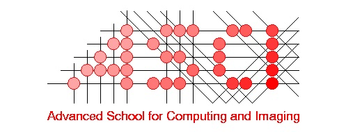

The Netherlands Conference on Computer Vision (NCCV) promotes computer vision research in the Netherlands. NCCV allows researchers to share previous and ongoing work. NCCV has a lunch-to-lunch schedule with an overnight stay to foster interaction between students, researchers, staff, and practitioners both during the scientific program and in the evening. We boast two excellent keynotes, poster sessions, lightning talks, two lunches, drinks and snacks, an elaborate dinner, and a social activity in the evening. We have limited space, so be sure to register early. 

**NCCV 2026** takes place on **June 17th and 18th**, in Doorwerth (near Arnhem), and is co-located with [CompSys](https://www.compsys.science/conference/current/).

We welcome everybody interested in computer vision in the Netherlands to join us!

### Key dates
-----------
* **Registration deadline:** May 8, 2026
* **Paper submission deadline:** May 8, 2026
* **Cancellation deadline:** May 12, 2026
* **Conference start:** June 17, 2026

### Sponsors
----------

        

                <table style="width:100%;">
                        <thead>
                                <tr>
                                        <th style="width:33%;background: #E5E4E2;"><h5> &ensp; PLATINUM</h5></th>
                                </tr>
                        </thead>
                        <tbody>
                                <tr>
                                        <td class="text-center" style="vertical-align:middle;">
                                                <a href="https://asci.school/">
                                                        
                                                </a>
                                        </td>
                                </tr>
                        </tbody>
                </table>
        

----------