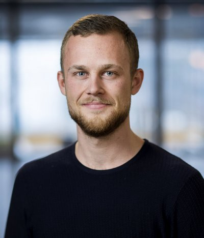
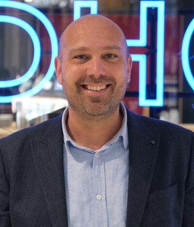
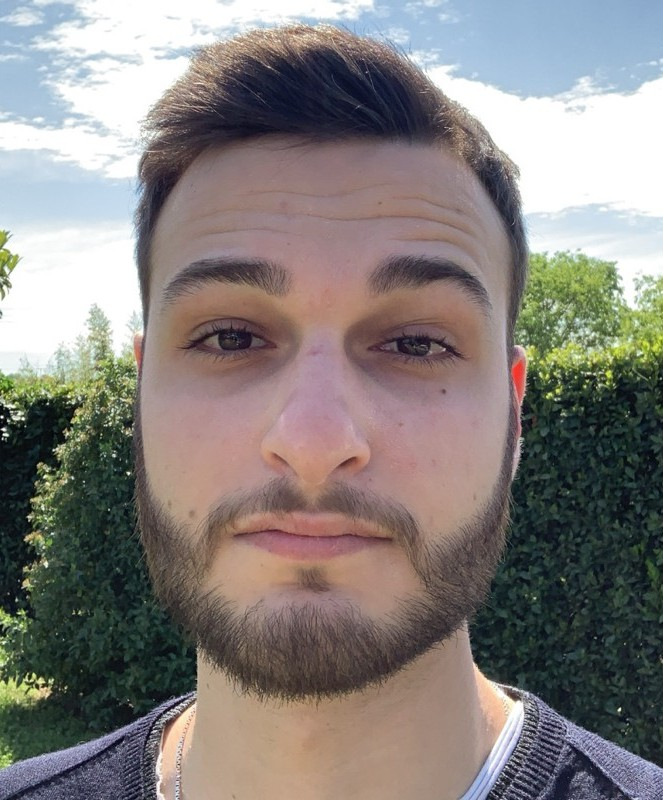
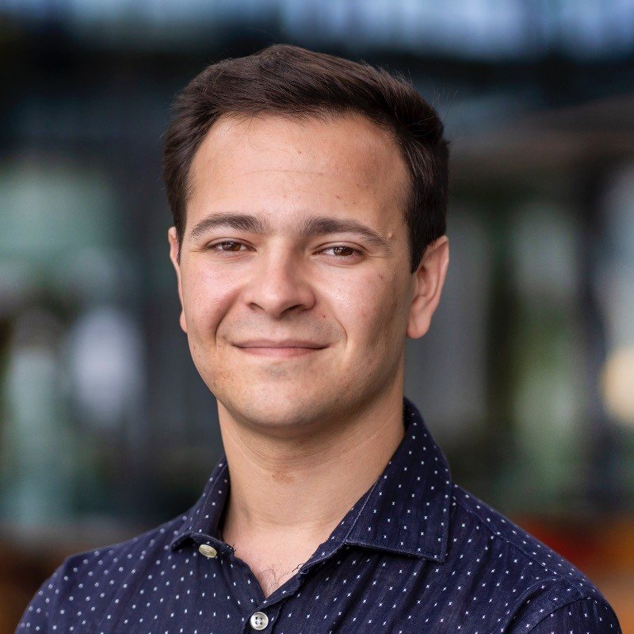
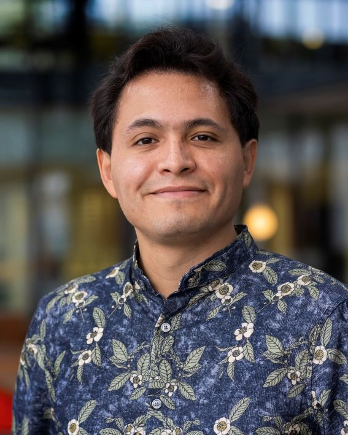
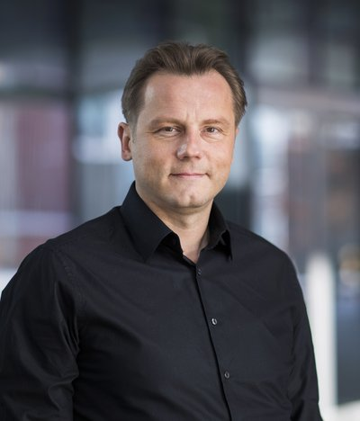
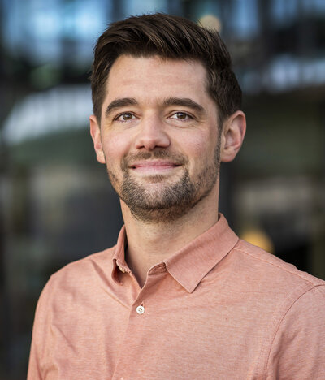
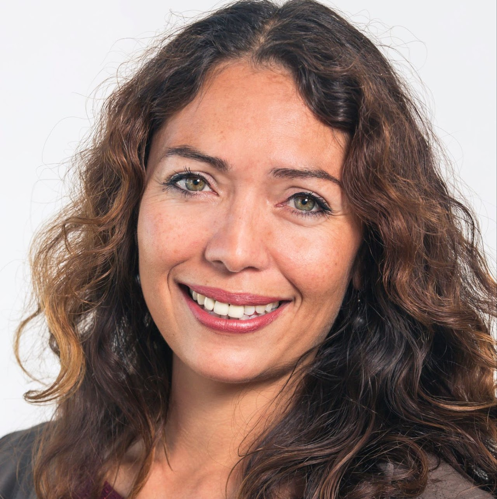

### Organizers

-----------

        

          

          

          
 

        

          
<a href="https://daandegeus.com" targe="_blank">Daan de Geus</a>

          
<a href="https://www.tue.nl/en/research/researchers/gijs-dubbelman" targe="_blank">Gijs Dubbelman</a>

          
<a href="https://research.tue.nl/en/persons/niccol%C3%B2-cavagnero/" targe="_blank">Niccol&ograve; Cavagnero</a>

        

          
 Eindhoven University of Technology

          
 Eindhoven University of Technology

          
 Eindhoven University of Technology

        

          
        

          
 

          
 

          
 

        

          
<a href="https://research.tue.nl/nl/persons/giacomo-damicantonio/" targe="_blank">Giacomo D'Amicantonio</a>

          
<a href="https://research.tue.nl/nl/persons/luis-a-zavala-mondragon/" targe="_blank">Luis A. Zavala Mondragon</a>

          
<a href="https://www.tue.nl/en/research/researchers/egor-bondarau" targe="_blank">Egor Bondarev</a>

        

          
 Eindhoven University of Technology

          
 Eindhoven University of Technology

          
 Eindhoven University of Technology

        

          
        

          

        

          
<a href="https://www.tue.nl/en/research/researchers/fons-van-der-sommen" targe="_blank">Fons van der Sommen</a>

        

          
 Eindhoven University of Technology

        

 

### Local arrangements

-----------

        

        
 

        

          
<a href="https://www.linkedin.com/in/paula-diks-1901344?miniProfileUrn=urn%3Ali%3Afs_miniProfile%3AACoAAAC7GvwBZYExqnNO7rW7_H9_urcbhBB1Klo&lipi=urn%3Ali%3Apage%3Ad_flagship3_search_srp_people%3Bi%2FkVM0JvTtuVUT%2FToDUO8A%3D%3D" targe="_blank">Paula Diks</a>

        

          
 ASCI

        

